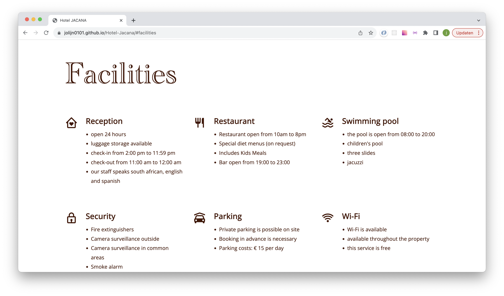
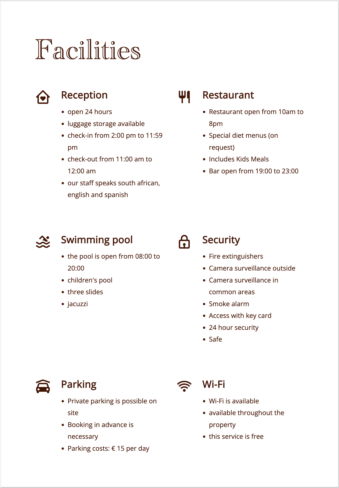
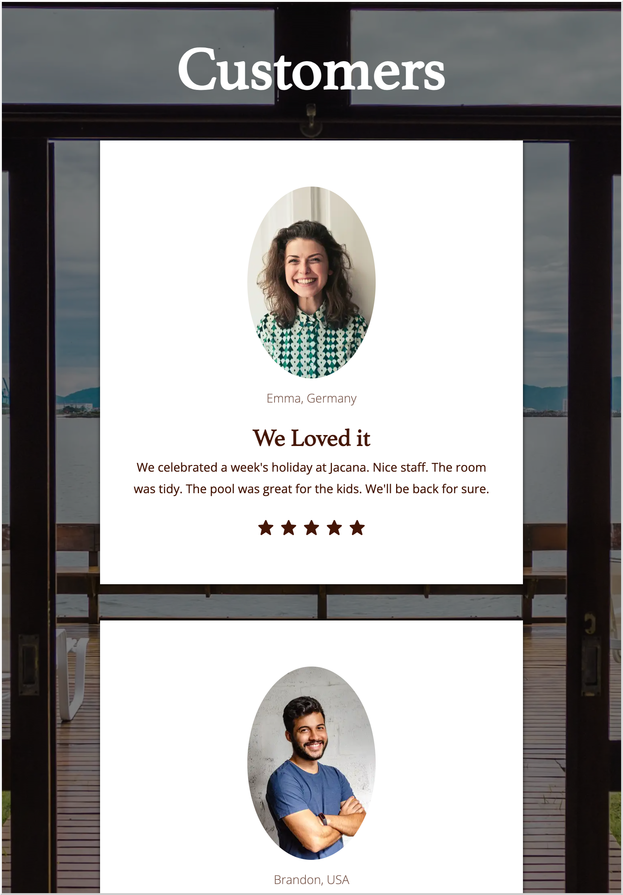
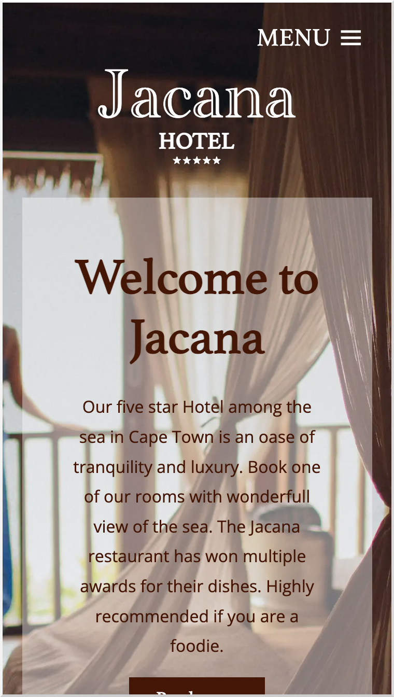

# Hotel Jacana website

First I followed a tutorial on youtube how to make a website for a Hotel. I learnt a lot from it and changed a few things. I made a logo for the website, changed colors, fonts, images and the text. Now I know how to make a one-page like this.

## Screenshots

  

### Links

- Repository URL: [github repository](https://github.com/Jolijn0101/Hotel-Jacana)
- Live Site URL: [github page](https://jolijn0101.github.io/Hotel-Jacana/)
